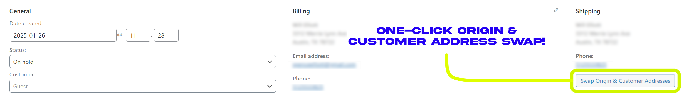
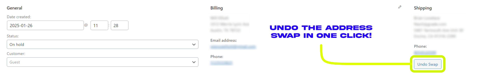

# WooCommerce Address Swap Plugin

Tired of manually copying and pasting sender and receiver addresses when creating return labels in WooCommerce? I was too! It used to take me **5+ minutes** just to swap addresses manually via copy/paste. That's why I decided to dive into the WooCommerce™ Shipping Plugin and create this **address swap solution** to save time and effort.

## 🚀 Features

- **One-Click Address Swap:**  
  Easily swap the sender and recipient addresses in WooCommerce orders with a single click.
- **Undo Swap Functionality:**  
  Restore the original shipping address anytime with the "Undo Swap" button.
- **No Time Limit on Undo:**  
  You can undo the swap anytime after it is performed.
- **AJAX-Powered:**  
  Instant address switching without page reloads.
- **Automatic Cleanup:**  
  Removes all non-default origin addresses from WooCommerce settings during the undo process.
- **Simple Integration:**  
  Copy and paste the script into your child theme or use a code snippets plugin.

---

## 🛠️ Installation

You can add this functionality by copying the PHP script into either:

1. **Child Theme’s `functions.php` file**  
   - Navigate to `Appearance > Theme File Editor > functions.php`  
   - Paste the script at the end of the file.

2. **Using a Code Snippets Plugin (Recommended)**  
   I recommend using **WPCodeBox**, but you can use any snippets plugin of your choice.

---

## ⚙️ WPCodeBox Settings

If you're using WPCodeBox, here’s how to configure the snippet:

- **"How to run the snippet":** `Always, on page load`
- **Hook/Priority:** `plugins_loaded / 10`
- **Snippet Order:** `10`
- **Where to run the snippet:** `Admin Area`

---

## 🖱️ How to Use

1. Open any **physical order** in WooCommerce.  
2. In the **Billing and Shipping details** panel, you'll see a button:  
   **“Swap Origin & Customer Addresses”**  
3. Click the button – the page will refresh as the magic happens via AJAX.  
4. Your sender address is now swapped with the recipient address.  
5. When creating a return label, simply select the new sender address (previous recipient) and verify it.

### **Undo the Swap**
If you need to revert the changes, simply click the **“Undo Swap”** button that appears after swapping. This will:

- Restore the original shipping and sender addresses.
- Automatically delete all non-default origin addresses from WooCommerce settings.

---

## 🔄 Automatic Cleanup of Origin Addresses

During the **Undo Swap** process, all origin addresses in the WooCommerce Shipping settings will be cleaned up, leaving only the default origin address intact. This helps maintain a tidy address list without requiring manual intervention.

---

## 💡 Notes

- Due to how the WooCommerce Shipping Plugin works, you’ll need to **manually verify the sender address** after swapping.  
  Simply click the sender address, select the new address, update a value, and click **Verify & Save** before purchasing your label.
- There is **no time limit** for undoing the swap, so you can revert it at any time.
- This solution significantly reduces the number of manual steps needed compared to the default process.

---

## ❓ Need Help?

If you have any questions or need assistance, feel free to reach out:

**Brian Lovelace**  
📧 [info@lovelacecreative.co](mailto:info@lovelacecreative.co)  
🌐 [lovelacecreative.co](https://lovelacecreative.co)

---

### 🚀 Enjoy faster label creation with fewer steps! Hope this helps!
